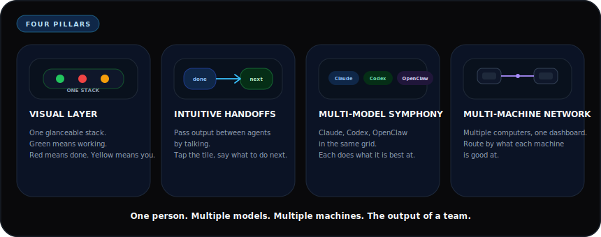

# Hive

Multi-agent orchestration layer for LLM-based development workflows. One dashboard across multiple models, multiple machines, and every handoff in plain English. macOS.



When multiple AI agents are working at the same time, the bottleneck quickly becomes coordination rather than generation. Terminal logs are manageable for a single process, but once several agents are active across different projects, it becomes difficult to track state, progress, and dependencies across sessions.

Hive is a lightweight visual coordination layer that mirrors active agent sessions as a grid of tiles with real-time status. The dashboard maps 1:1 to your terminal layout. Green means working. Red means done. Yellow means it needs you. You look at your phone and know exactly which terminal needs attention without reading output.

One person. Multiple models. Multiple machines. The output of a team.

## Motivation

Running one AI agent is manageable. Running several at once on different tasks is where things break down. You lose track of which one finished, which one is stuck, and which one drifted. You end up alt-tabbing between terminals, re-reading output, and spending more energy tracking status than directing work.

As multi-agent workflows become more common, development starts to look less like writing code and more like coordinating processes. Better orchestration, visibility, and control layers become as important as model capability.

Hive was built to reduce that overhead. Once the workflow became visible, development became significantly easier to manage.

## What It Does

The system solves four problems at once:

**1. Visual layer.** A stoplight dashboard that mirrors your terminal layout. Tiles stacked vertically, top to bottom, matching where your terminals sit on screen. Color tells you the state at a glance. Spatial memory replaces terminal names. You catch problems by looking, not reading.

**2. Intuitive handoffs.** One agent finishes, you tap the next tile and describe what to do with its output. Hive delivers the message. For planned sequences, a task queue carries context forward automatically, passing a summary of what the previous agent did and which files it changed.

**3. Multi-model coordination.** Run Claude, Codex, and OpenClaw in the same grid. Each model does what it is best at. Claude reasons about architecture. Codex moves fast through surgical edits. Different models audit each other's blind spots. You conduct them like instruments in the same symphony.

**4. Multi-machine network.** Connect multiple computers to one dashboard. A second Mac appears in the same tile stack within seconds. Each machine reports its capabilities. Route work to the right hardware. Every computer you own feeds into one control plane.

## Features

- **Stoplight dashboard** — green/red/yellow at a glance. Open on your phone, tablet, or second monitor. Supports 1-8 agents per machine.
- **Multi-model** — Claude, Codex, OpenClaw side by side. Spawn any from the dashboard. Add custom agents via `~/.hive/agents.json`.
- **Multi-machine** — connect additional Macs as satellites. Agents from all machines appear in one dashboard. Messages, tasks, and coordination route transparently across the network.
- **Auto-discovery** — start any supported agent in a terminal and it appears on the dashboard within 3 seconds. No registration, no config.
- **Auto-pilot** — permission prompts auto-approve after a 3-second grace window. Stuck loops get caught and surfaced. Agents never sit idle.
- **Messaging** — tap any tile, type a message, it goes straight to that agent's terminal. Messages queue if the agent is busy.
- **Coordination** — file locks, conflict detection, task queue, scratchpad. Multiple agents on the same codebase without collisions.
- **Workflow handoff** — tag related tasks with a workflow ID. When step 1 finishes, step 2 receives a summary of what was done before it starts.
- **Model-aware routing** — tasks can target a specific model (`"model":"codex"`), require machine capabilities (`"requires":["gpu"]`), or prefer a specific machine.
- **Capability detection** — each machine auto-reports CPU, RAM, GPU, installed software. Custom tags via `~/.hive/capabilities.json`.
- **Compound learning** — every solved problem gets written to a per-project knowledge file. Fresh agents start with accumulated knowledge.
- **State persistence** — daemon snapshots every 30 seconds. Survives restarts. Satellites run as launchd services and survive sleep and reboot.
- **Push notifications** — macOS native alerts when agents get stuck. Web Push to your phone when agents finish. PWA installable on iOS and Android.
- **Review queue** — auto-detects git pushes, deploys, and PRs across all agents. Slide-out drawer on the dashboard.

## Background

Built by Rohit Mangtani. MBA in Business Analytics and BS in Computer Information Systems from Bentley University. Currently working in fixed income operations at RBC. Background in finance, data analysis, and quantitative systems.

This project came out of running multiple AI agents daily across several projects and needing a way to manage the coordination overhead. The system was built using the agents it manages: multiple Claude and Codex instances iterating on the daemon, dashboard, and each other's output simultaneously.

## Prerequisites

- **macOS** (uses AppleScript + CGEvent for terminal interaction)
- **Node.js 20+** — [nodejs.org](https://nodejs.org)
- **Homebrew** — [brew.sh](https://brew.sh) (for installing Cloudflare tunnel and other optional dependencies)

That's it. Everything else is optional and the setup script handles it gracefully:

| Optional | What it enables | How to get it |
|----------|----------------|---------------|
| At least one AI CLI | Agents to manage | `npm install -g @anthropic-ai/claude-code` or `@openai/codex` or `openclaw` |
| Xcode Command Line Tools | Auto-pilot (auto-approve prompts) | `xcode-select --install` |
| ngrok (recommended) | Phone/remote access, stable URLs | `brew install ngrok` then `ngrok config add-authtoken YOUR_TOKEN` ([ngrok.com](https://ngrok.com)) |
| Cloudflare tunnel (fallback) | Phone/remote access, random URLs | `brew install cloudflared` |
| Vercel account | Hosted dashboard | `npx vercel login` |

Without an AI CLI, setup still completes — install one later and agents auto-appear. Without `swiftc`, everything works except auto-pilot. Without Vercel/cloudflared, use `npm run launch:local` for localhost-only.

Claude, Codex, and OpenClaw can be mixed freely. Claude gets the richest hook-based telemetry. Codex and OpenClaw work out of the box through JSONL, CPU, and PTY detection. Any other terminal agent can be added via a config file (see [Custom Agents](#custom-agents)).

## Install

Before you paste, you'll need to approve a few things as the agent works. These are all one-time prompts from your CLI and macOS — say yes to each and the agent continues on its own:

1. **Allow shell commands** — Claude Code or Codex will ask permission to run terminal commands. Approve it.
2. **Allow file access to `~/`** — the agent needs to write to `~/.hive/` for config and tokens. When it asks to expand scope beyond the project directory, approve it.
3. **Sandbox mode** — if your CLI asks, select **full sandbox** so the agent can run commands without pausing on every action.

Paste this into Claude Code or Codex:

> Install Hive for me. Clone https://github.com/RohitMangtani/hive. Before running the install script, ask me: "Do you want to (1) start a new Hive environment with your own dashboard, or (2) join an existing Hive network on another computer?" If I choose 1, run `bash scripts/install.sh --fresh`. It handles setup, dependencies, Vercel login, the daemon, and dashboard deploy. When Vercel opens my browser, I'll click authorize and it continues. Give me the dashboard URL and token it prints at the end. If I choose 2, ask me for the tunnel URL and token from the other machine, then run `bash scripts/install.sh --connect <URL> <TOKEN>` with what I provide. Give me whatever it prints at the end.

**What you need beforehand:**
- macOS with Node.js 20+ installed
- A free [Vercel](https://vercel.com) account (the dashboard deploys here so you can access it from any device)
- At least one AI CLI installed: `claude`, `codex`, or `openclaw`

### After install — one-time macOS approvals

Once the agent finishes and Hive is running, macOS may ask for a couple more permissions the first time you use certain features:

4. **Automation permission** — macOS asks "Terminal wants to control Terminal." Click **OK**. This lets Hive send messages to agents and close terminals from the dashboard. If you miss it: System Settings → Privacy & Security → Automation.
5. **Accessibility permission** (optional) — if setup compiled the auto-pilot binary, it opens System Settings and Finder. Drag `send-return` into the Accessibility list and toggle it on. This lets agents auto-approve their own prompts. Skip if you prefer manual approval.

### Using your token

Once setup finishes, the agent prints your token. Copy it. Open the dashboard URL the agent gives you, paste the token into the input field at the top of the page, and hit enter. You now have full control — send messages to agents, spawn new ones, close them with the X button on each tile, and manage your fleet. The token is saved at `~/.hive/token` if you need it again.

### Running agents

Open Terminal.app windows and run `claude`, `codex`, or `openclaw tui`. They appear on the dashboard within 3 seconds.

### Connect another computer

You can connect multiple Macs to the same Hive dashboard. Terminals on the second machine appear alongside your local ones — chat, close, and manage them all from one screen.

On the second computer, run the same install prompt or clone and run:

```bash
bash scripts/install.sh --connect wss://YOUR-TUNNEL-URL YOUR-TOKEN
```

The tunnel URL and token are printed at the end of the primary install. You can also find them at `~/.hive/tunnel-url.txt` and `~/.hive/token` on the primary machine. The connect command also appears in the install output.

Satellite terminals show a machine badge on the dashboard so you can tell which computer each agent is running on. Everything works through the Cloudflare tunnel — the machines don't need to be on the same network. The satellite runs as a background service (launchd) — it survives sleep, reboot, and terminal close. If macOS asks you to approve Node.js in System Settings → Privacy & Security, click Allow once.

### Local-only install (no Vercel needed)

If you just want localhost access without deploying anywhere:

```bash
git clone https://github.com/RohitMangtani/hive.git
cd hive
npm run launch:local
```

## Setup

Setup runs automatically when you launch Hive for the first time. You can also run it manually:

```bash
bash setup.sh
```

The setup script:
1. Checks Node.js 20+ (required)
2. Detects installed AI CLIs (warns if none found, does not block)
3. Installs all npm dependencies (monorepo workspaces)
4. Generates `~/.hive/token` and `~/.hive/viewer-token`
5. Compiles the `send-return` Swift binary for auto-pilot (skipped if `swiftc` not available)
6. Installs or updates Claude Code hooks if Claude is present
7. Creates `.env` from the template
8. Prints your auth token

### Accessibility Permission (optional — for auto-pilot)

If `swiftc` was available, setup compiles `~/send-return` and automatically opens System Settings and Finder for you:

1. **Drag** `send-return` from the Finder window into the Accessibility list
2. **Toggle it on**

That's it. Without this, agents pause on permission prompts until you approve manually. Everything else works fine.

## Running

You have three supported ways to run Hive:

**Standard hosted launch** (recommended)
```bash
npm run launch
```

This starts the local daemon on `3001/3002`, opens the current public tunnel for the WebSocket server, deploys or updates the dashboard to your own Vercel account, opens the hosted dashboard URL, and keeps the daemon and tunnel running in one terminal. On a new machine, run `npx vercel login` once first.

**Local-only fallback**
```bash
npm run launch:local
```

This starts the daemon and dashboard locally, opens `http://localhost:3000`, and keeps both running in one terminal.

**Manual hosted split** (same hosted behavior, separate steps)
```bash
npm start
npm run deploy:dashboard
```

This is the same hosted flow as `npm run launch`, but split into two commands.

**Manual local split** (same local behavior, separate terminals)
```bash
npm run dev:daemon
npm run dev:dashboard
```

This opens the dashboard at `localhost:3000`.

**Agents** (open Terminal.app windows and run any supported CLI you installed)
```bash
claude
```
or
```bash
codex
```
or
```bash
openclaw tui
```

Stack your terminal windows vertically on screen. The daemon detects their positions and maps each one to the matching tile in the dashboard stack. Mix `claude`, `codex`, and `openclaw` however you want. You can also spawn agents from the dashboard: tap "+ Agent", pick a model, optionally add a task, and hit Spawn. If the CLI isn't installed, the tile shows a clear error instead of silently failing.

**4. Install the app on your phone** (optional, recommended)

Open the dashboard URL on your phone and add it to your home screen. It runs full-screen like a native app. See the [Install as App](#install-as-app) section below.

## Using the Tiles

**Assign tasks by complexity, not by file.** Give your hardest task to the top tile so you can keep an eye on it. Put your most independent tasks in the lower tiles where they can run unattended longest.

**Bridge context between agents.** When one agent discovers something another needs, tap the other tile and paste the finding. Or use the scratchpad so any agent can read it.

**Give commands to specific agents.** Tap any tile and type a plain English instruction: "Stop what you are doing and fix the login bug first" or "Read what the agent above just committed and review it." The message goes straight to that agent's terminal as if you typed it there.

## How It Works

### Auto-Discovery
Detects Claude, Codex, and OpenClaw processes within 3 seconds via `ps` + `lsof`. No configuration needed. Start `claude`, `codex`, or `openclaw tui` in any terminal and the daemon finds it. Supports up to 8 agents simultaneously. The daemon reads the vertical position of each Terminal window on your screen every 10 seconds and assigns slots to match. Move a terminal higher on screen, it moves up in the dashboard stack. Tab titles update automatically to show which slot each terminal is.

### Status Tracking
Multi-layer detection pipeline determines real-time status:
1. **Hook events** — Claude Code hooks report every tool call to the daemon (Claude agents)
2. **JSONL analysis** — reads the agent's conversation log for recent activity, extracts the last user message as a direction summary (Claude and Codex)
3. **CPU signal** — falls back to CPU usage (>8% = working) when hooks are delayed (all agents)
4. **PTY output** — detects terminal output flow for agents actively generating text

### Auto-Pilot
Auto-approves permission prompts so agents never sit idle waiting for you. The daemon detects when an agent is stuck on a prompt, waits a 3-second grace window (so you can override from the dashboard), then sends a Return keystroke via the `send-return` binary.

This is how you run agents unattended. You give them tasks and walk away. Auto-pilot keeps them moving.

### Coordination
Multiple agents can safely work on the same codebase:
- **Peer awareness** — Claude agents get a one-line summary of what the other agents are doing via the identity hook, including status, project, current action, machine label, and project path. Codex workers still share the same fleet state through the dashboard, scratchpad, and REST API.
- **File locks** — acquire advisory locks before editing shared files (`POST /api/locks`)
- **Conflict detection** — check if another agent recently modified a file (`GET /api/conflicts`)
- **Scratchpad** — leave ephemeral notes for other agents (`POST /api/scratchpad`), auto-expires in 1 hour
- **Inter-agent messaging** — send a prompt to any other agent (`POST /api/message`)
- **Task queue** — push tasks to a global queue, auto-dispatched to the next idle agent (`POST /api/queue`)
- **Workflow handoff** — tag tasks with the same `workflowId` and the daemon passes completion context automatically. When Agent 1 finishes step 1, the daemon builds a summary of what it did (files created, files edited) and prepends it to step 2 before dispatching to the next agent. Queue it like this:

```bash
# Step 1: Build the API
curl -s -H "Authorization: Bearer $TOKEN" -H "Content-Type: application/json" \
  -d '{"task":"Build API endpoints for users","project":"/path/to/project","workflowId":"feature-auth"}' \
  http://localhost:3001/api/queue

# Step 2: Build the UI (waits for step 1)
curl -s -H "Authorization: Bearer $TOKEN" -H "Content-Type: application/json" \
  -d '{"task":"Build UI against the API","project":"/path/to/project","workflowId":"feature-auth","blockedBy":"STEP1_ID"}' \
  http://localhost:3001/api/queue
```

Agent 2 receives: "Previous step completed by Q3: created src/api/users.ts, created src/api/auth.ts. Your task: Build UI against the API."

### Compound Learning
Every solved problem gets written to a per-project knowledge file (`.claude/hive-learnings.md`). The next agent that works on that project reads it before starting. Every debugging session, every style correction, every architectural decision compounds. After months of running, the system knows things about your projects that no fresh agent could replicate.

### State Persistence
The daemon writes `~/.hive/daemon-state.json` every 30 seconds and on shutdown. If the daemon restarts, it rehydrates workers, message queues, locks, and workflow handoffs from the snapshot (discarded if older than 10 minutes). Discovery reconciles actual processes within 3 seconds. You do not configure this. It just works.

### Session Routing (Restart Resilience)
When you open 4 terminals within seconds of each other, their session log files are created nearly simultaneously. The daemon needs to know which log file belongs to which terminal. It solves this with marker files for Claude and rollout-log matching for Codex:

1. Claude terminals write `~/.hive/sessions/{tty}` with their session ID on every prompt (via the `identity.sh` hook)
2. The daemon reads those marker files on startup and uses them as ground truth, while Codex workers are re-associated from their rollout JSONL files
3. Marker files persist across computer restarts, so Claude mappings are durable too

On a fresh computer restart, the old marker files are overwritten the moment you type your first prompt in each terminal. The daemon picks up the correct mapping within 3 seconds. This means routing is accurate after one prompt per terminal, which is invisible to you since you would be typing anyway.

### Push Notifications
Two channels, zero setup:

- **macOS desktop** — when an agent goes stuck (yellow), a native notification fires with the agent name, project, and what it needs. 60-second cooldown per agent.
- **Web Push (iOS/Android/desktop browser)** — when an agent finishes work (green to red), a push notification is sent to all subscribed devices. 15-second cooldown per agent. The dashboard is a PWA. Add it to your Home Screen, tap the bell icon in the header, and allow notifications. VAPID keys are auto-generated on first daemon start (`~/.hive/vapid.json`). Subscriptions persist across daemon restarts (`~/.hive/push-subs.json`).

Configure at `~/.hive/notifications.json`. Set `pushOnComplete: false` to disable completion notifications. Defaults work out of the box.

### Watchdog
Monitors agents for stuck loops (same tool called 6+ times in a row). Detects when agents are spinning on a problem and escalates to the dashboard so you can intervene. Does not send messages to agents automatically.

## API Reference

All endpoints require the auth token from `~/.hive/token` via the `Authorization: Bearer <token>` header.

**Base URL:** `http://localhost:3001`

### Workers
| Method | Endpoint | Description |
|--------|----------|-------------|
| `GET` | `/api/workers` | List all agents with status, TTY, project, current action |

### Messaging
| Method | Endpoint | Body | Description |
|--------|----------|------|-------------|
| `POST` | `/api/message` | `{workerId, content}` | Send a prompt to any agent. Queued if busy, returns message ID. |
| `GET` | `/api/message-queue` | — | View queued messages with IDs, previews, and timestamps |
| `DELETE` | `/api/message-queue/:id` | — | Cancel a queued message before it's delivered |

### Task Queue
| Method | Endpoint | Body | Description |
|--------|----------|------|-------------|
| `GET` | `/api/queue` | — | View all queued tasks |
| `POST` | `/api/queue` | `{task, project?, priority?, blockedBy?, workflowId?, requires?, preferMachine?, model?}` | Push a task. Auto-dispatched to next idle agent. Add `workflowId` to link related tasks for automatic handoff. Add `requires` for capability routing (see below). Add `model` to target a specific agent type. |
| `DELETE` | `/api/queue/:id` | — | Remove a queued task |

**Capability routing:** Tasks can target specific machines or agent types:

```bash
# Only dispatch to machines with GPU and ffmpeg
curl -s -H "Authorization: Bearer $TOKEN" -H "Content-Type: application/json" \
  -d '{"task":"Render the video","requires":["gpu","ffmpeg"]}' \
  http://localhost:3001/api/queue

# Prefer a specific machine, fall back to any capable one
curl -s -H "Authorization: Bearer $TOKEN" -H "Content-Type: application/json" \
  -d '{"task":"Train the model","requires":["pytorch","gpu"],"preferMachine":"desktop-gpu"}' \
  http://localhost:3001/api/queue

# Only dispatch to Codex agents
curl -s -H "Authorization: Bearer $TOKEN" -H "Content-Type: application/json" \
  -d '{"task":"Review this PR","model":"codex"}' \
  http://localhost:3001/api/queue
```

| Field | Type | Description |
|-------|------|-------------|
| `requires` | `string[]` | Capability keys the machine must have. Matches auto-detected capabilities (gpu, ffmpeg, docker, python, pytorch, tensorflow) and custom tags from `~/.hive/capabilities.json`. Task waits in queue until a capable machine has an idle agent. |
| `preferMachine` | `string` | Machine ID to prefer. If that machine has an idle agent, it gets the task. Otherwise falls back to any capable machine. Use `"local"` for the primary. |
| `model` | `string` | Agent model to target (e.g. `"claude"`, `"codex"`, `"openclaw"`). Task only dispatches to agents running that model. |

Satellites auto-detect their capabilities on startup and report them to the primary. Add custom tags by creating `~/.hive/capabilities.json`:

```json
{ "tags": ["vpn", "prod-access", "large-disk"] }
```

### File Coordination
| Method | Endpoint | Body / Query | Description |
|--------|----------|--------------|-------------|
| `GET` | `/api/locks` | — | List all active file locks |
| `POST` | `/api/locks` | `{workerId, path}` | Acquire lock. Returns 409 if already locked. |
| `DELETE` | `/api/locks` | `?workerId=X&path=Y` | Release lock (omit path to release all) |
| `GET` | `/api/conflicts` | `?path=X&excludeWorker=Y` | Check if another agent recently modified a file |

### Scratchpad
| Method | Endpoint | Body / Query | Description |
|--------|----------|--------------|-------------|
| `GET` | `/api/scratchpad` | `?key=X` (optional) | Read notes. Omit key for all entries. |
| `POST` | `/api/scratchpad` | `{key, value, setBy}` | Set a shared note. Auto-expires in 1 hour. |
| `DELETE` | `/api/scratchpad` | `?key=X` | Remove a note |

### Learning & Artifacts
| Method | Endpoint | Body / Query | Description |
|--------|----------|--------------|-------------|
| `POST` | `/api/learning` | `{project, lesson}` | Persist a lesson to the project's learning file |
| `GET` | `/api/artifacts` | `?workerId=X` (optional) | Recent file changes by an agent |

### Review Queue
| Method | Endpoint | Body / Query | Description |
|--------|----------|--------------|-------------|
| `GET` | `/api/reviews` | `?unseen=1` (optional) | List review items. Add `?unseen=1` for unread only. |
| `POST` | `/api/reviews` | `{summary, url?, type?, workerId?}` | Report a reviewable change. Type: deploy/commit/pr/push/review-needed/general. |
| `PATCH` | `/api/reviews/:id` | `{action: "seen"}` | Mark a review as seen |
| `PATCH` | `/api/reviews` | — | Mark all reviews as seen |
| `DELETE` | `/api/reviews/:id` | — | Dismiss a review |

The daemon also auto-detects `git push`, `gh pr create`, and Vercel deploys from hook events and creates review items automatically. Agents can self-report with richer summaries via the POST endpoint.

### Diagnostics
| Method | Endpoint | Query | Description |
|--------|----------|-------|-------------|
| `GET` | `/api/audit` | `?tty=X` (optional) | Status change audit log |
| `GET` | `/api/signals` | `?workerId=X` (optional) | Raw signal data (hooks, CPU, JSONL) |
| `GET` | `/api/debug` | — | Full daemon state dump |

### Example: Send a task to an idle agent

```bash
TOKEN=$(cat ~/.hive/token)

# Check who's available
curl -s -H "Authorization: Bearer $TOKEN" http://localhost:3001/api/workers | jq '.[] | {id, tty, status}'

# Send a message to a specific agent
curl -s -H "Authorization: Bearer $TOKEN" \
  -H "Content-Type: application/json" \
  -d '{"workerId":"WORKER_ID","content":"Fix the login bug in src/auth.ts"}' \
  http://localhost:3001/api/message

# Queue a task for the next idle agent
curl -s -H "Authorization: Bearer $TOKEN" \
  -H "Content-Type: application/json" \
  -d '{"task":"Write tests for the payment module","project":"/path/to/project"}' \
  http://localhost:3001/api/queue
```

## How Agents Use Hive

Claude agents read instructions from `~/.claude/CLAUDE.md` that tell them how to interact with the daemon. Here's what that hook-driven path does automatically:

1. **Identify themselves** — read `~/.hive/workers.json` on startup to find their slot. On every prompt, the identity hook also injects a peer summary showing what the other agents are doing, where they are running, and which project path they have open.
2. **Check learnings** — read `.claude/hive-learnings.md` before starting any task
3. **Lock files** — acquire locks before editing files other agents might touch
4. **Write learnings** — persist lessons after solving non-obvious problems
5. **Dispatch work** — send tasks to other agents when the work involves a different project or needs a fresh perspective
6. **Use scratchpad** — leave notes about in-progress work for other agents

These behaviors are configured through the CLAUDE.md instructions, not hardcoded. Codex workers still participate in discovery, messaging, queueing, and shared state, but they do not use the Claude hook path.

## Custom Agents

Hive ships with Claude, Codex, and OpenClaw support built in. To add any other terminal agent, create `~/.hive/agents.json`:

```json
[
  {
    "id": "aider",
    "label": "Aider",
    "processPattern": "aider",
    "spawnCommand": "aider",
    "sessionDir": "~/.aider/sessions/"
  }
]
```

| Field | Required | Description |
|-------|----------|-------------|
| `id` | yes | Unique identifier (used internally) |
| `label` | yes | Display name on dashboard |
| `processPattern` | yes | Regex to match the process in `ps` output |
| `spawnCommand` | yes | CLI command to run in Terminal.app |
| `sessionDir` | no | Directory to scan for JSONL session files |

The daemon watches this file and reloads when it changes. No restart needed.

**The easiest way to add a new agent:** Ask one of your running agents. Tell Claude or Codex "add Aider support to Hive" and it writes the config entry to `~/.hive/agents.json`. The daemon picks it up on the next scan.

## Configuration

### Environment Variables (.env)

| Variable | Default | Description |
|----------|---------|-------------|
| `HIVE_PROJECT` | Auto-detected | Path to the Hive project root |
| `SEND_RETURN_BIN` | `~/send-return` | Path to the CGEvent binary for auto-pilot |
| `NEXT_PUBLIC_WS_URL` | `ws://localhost:3002` | WebSocket URL the dashboard connects to |

### Claude Code Hooks

If Claude Code is installed, setup installs or updates these hooks in `~/.claude/settings.json`:
- **UserPromptSubmit** — registers the TTY/session mapping and injects identity + peer summary
- **PreToolUse** — fires before every tool call, reports tool name to daemon
- **PostToolUse** — fires after every tool call, reports result
- **Notification** — fires on agent notifications (errors, completions)
- **Stop** — fires when an agent session ends

`bash setup-hooks.sh` is idempotent. It merges Hive hooks into existing settings instead of replacing them.

### Authentication

Setup generates a random token at `~/.hive/token`. All API requests require this token. The daemon reads it on startup. Agents read it via their hook commands.

## Architecture

```
Daemon (Node.js, port 3001 + 3002)
├── Discovery     — finds Claude + Codex + OpenClaw processes via ps + lsof every 3s
├── Telemetry     — receives hook events and inferred signals, maintains worker state
├── Auto-pilot    — detects stuck prompts, auto-approves via send-return
├── Arrange       — detects terminal positions, assigns slots by screen location
├── Watchdog      — detects stuck loops, escalates to dashboard
├── State store   — snapshots daemon state every 30s, restores on restart
├── Notifications — macOS native alerts when agents go stuck
├── Task queue    — global work queue, auto-dispatches to idle agents
├── Coordination  — file locks, scratchpad, conflict detection, learnings
├── API routes    — REST endpoints for all coordination features
└── WebSocket     — pushes live state to dashboard every 3 seconds

Dashboard (Next.js, port 3000 — installable as PWA)
├── Vertical stack — stoplight status cards matching terminal layout top to bottom
├── Live chat     — stream each agent's conversation history
├── Review queue  — slide-out drawer of recent pushes, deploys, and PRs
├── Controls      — send messages, spawn agents, view queue
└── Service worker — offline caching, instant repeat loads
```

### Key Files

| File | Purpose |
|------|---------|
| `apps/daemon/src/index.ts` | Entry point, initializes all systems |
| `apps/daemon/src/discovery.ts` | Process discovery and status detection |
| `apps/daemon/src/telemetry.ts` | Hook event receiver, worker state machine |
| `apps/daemon/src/auto-pilot.ts` | Automatic prompt approval |
| `apps/daemon/src/tty-input.ts` | AppleScript + CGEvent terminal interaction |
| `apps/daemon/src/arrange-windows.ts` | Window position detection and slot assignment |
| `apps/daemon/src/api-routes.ts` | All REST API endpoints |
| `apps/daemon/src/ws-server.ts` | WebSocket server for dashboard |
| `apps/daemon/src/watchdog.ts` | Stuck loop detection |
| `apps/daemon/src/state-store.ts` | Snapshot persistence across restarts |
| `~/.hive/identity.sh` | Claude hook: injects slot ID + peer summary on every prompt |
| `~/.hive/sessions/` | Claude TTY→session marker files written by `identity.sh` |
| `apps/daemon/src/notifications.ts` | macOS push notifications on stuck |
| `apps/daemon/src/task-queue.ts` | Global task queue |
| `apps/daemon/src/lock-manager.ts` | File lock coordination |
| `apps/daemon/src/review-store.ts` | Review queue for tracking reviewable changes |
| `apps/daemon/src/scratchpad.ts` | Ephemeral shared notes |
| `apps/daemon/src/session-stream.ts` | Chat history streaming from JSONL |
| `tools/send-return.swift` | CGEvent binary source (Return keystroke) |
| `packages/types/` | Shared TypeScript types |

## Troubleshooting

**Agents not showing up on dashboard**
- Make sure the daemon is running (`npm run dev:daemon`)
- If you're running Claude, check that hooks are configured: `cat ~/.claude/settings.json | grep hooks`
- If you're running Codex only, missing Claude hooks is expected
- The daemon discovers agents every 3 seconds. Wait a moment.

**Auto-pilot not working (agents stuck on prompts)**
- Grant Accessibility permission to `~/send-return` (see Setup section)
- Test it manually: `~/send-return` should send a Return keystroke to the frontmost app
- Check daemon logs for `[auto-pilot]` messages

**"Connection refused" errors**
- Daemon must be running on port 3001 before agents start
- Check nothing else is using port 3001: `lsof -i :3001`

**Dashboard shows stale data after restart**
- This is normal for the first few seconds. Send one prompt to each terminal and the routing self-corrects.
- Refresh the page. WebSocket reconnects automatically.
- Check that port 3002 is reachable: `curl http://localhost:3002`

**Chat history showing in the wrong terminal**
- The daemon may have mapped session files incorrectly. Send a prompt to each terminal and the marker files update automatically.
- Check marker files: `ls ~/.hive/sessions/` should show one file per active TTY
- Force re-mapping: restart the daemon (`npm run dev:daemon`)

**Hooks not reporting events**
- This applies to Claude Code only
- Verify hooks exist: `cat ~/.claude/settings.json | jq .hooks`
- Re-run `bash setup-hooks.sh` to repair or update the Hive hook entries.
- Test a hook manually: start `claude`, use any tool, check daemon logs for `[telemetry]` events.

**Build errors**
- Make sure you're on Node.js 20+: `node -v`
- Try `npm install` from the project root
- For TypeScript errors: `npx turbo build` to see full output

## Install as App

The dashboard is a PWA (Progressive Web App). After deploying, install it on your phone for the best experience:

**iPhone / iPad:**
1. Open the dashboard URL in Safari
2. Tap the share button (box with arrow)
3. Tap "Add to Home Screen"
4. Open from your home screen — full-screen, no browser chrome

**Android:**
1. Open the dashboard URL in Chrome
2. Tap the three-dot menu
3. Tap "Add to Home screen" or "Install app"

The app caches itself via service worker, so repeat opens are instant. It works like a native app — own icon, own entry in the app switcher, dark status bar matching the dashboard theme.

## Deploy Your Own Dashboard

For a hosted dashboard, use the current Hive architecture:

1. `npm start` to run the daemon and create a public tunnel for `ws://localhost:3002`
2. `npm run deploy:dashboard` to deploy `apps/dashboard` to your own Vercel account using that tunnel URL
3. Keep `npm start` running while you use the deployed dashboard

`npm run deploy:dashboard` reads the current tunnel URL from `~/.hive/tunnel-url.txt`, converts it to `wss://...`, and passes it to Vercel as `NEXT_PUBLIC_WS_URL` for that deployment.

Every clone is a completely independent instance. Setup generates a unique auth token at `~/.hive/token`. Your daemon, your agents, your dashboard, your data. Nothing connects to anyone else's setup. Two people can run Hive on the same network without any interference.

## Development

```bash
# Install dependencies
npm install

# Run daemon in dev mode (auto-restarts on changes)
npm run dev:daemon

# Run dashboard in dev mode
npm run dev:dashboard

# Build everything
npm run build

# Run tests
npm -w apps/daemon test
```

The project uses npm workspaces with Turbo for build orchestration. The daemon and dashboard are separate apps that share types via `packages/types/`.

## Status

Active personal tool, used daily. Open to feedback and ideas from others working on multi-agent workflows.

## License

MIT
